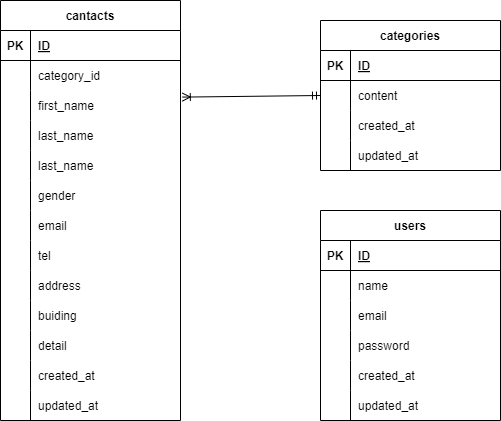

## アプリケーション名
確認テスト：XXX

## 環境構築
```
リポジトリからダウンロード
git clone <リポジトリURL>

srcディレクトリにある「.env.example」をコピーして 「.env」を作成し DBの設定を変更
$ cp .env.example .env
---
DB_HOST=XXX
DB_DATABASE=XXX
DB_USERNAME=XXX
DB_PASSWORD=XXX
---

dockerコンテナを構築
$ docker-compose up -d --build

Laravelをインストール
$ docker-compose exec php bash
> composer install

アプリケーションキーを作成
> php artisan key:generate

DBのテーブルを作成
> php artisan migrate

DBのテーブルにダミーデータを投入
> php artisan db:seed

"The stream or file could not be opened"エラーが発生した場合
ディレクトリ/ファイルの権限を変更
$ sudo chmod -R 777 src/storage
```

## ER図
